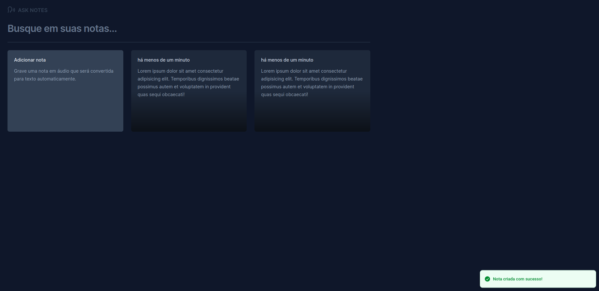

# Ask Notes


> Ask Notes é uma plataforma de anotações que permite a criação de notas através da fala, utilizando as APIs de reconhecimento de voz dos navegadores mais recentes.

## 💻 Demonstração



## ⚠️ Pré-requisitos

- Node 20.11.0+

## 🚀 Execução do projeto

```bash
# Clone do repositório
$ git clone https://github.com/ImGabreuw/ask-notes.git

# Acessar o diretório do projeto
$ cd ask-notes

# Instalar as dependências
$ npm i

# Executar a aplicação
$ npm run dev
```

Acesse http://localhost:5173/

## 📫 Contribuição

Para contribuir com **ask-notes**, siga estas etapas:

1. Bifurque este repositório.
2. Crie um branch: `git checkout -b <nome da funcionalidade>`.
3. Faça suas alterações e confirme-as: `git commit -m '<breve descrição sobre a funcionalidade>'`
4. Envie para o branch original: `git push origin <feature/funcionalidade>`
5. Crie a solicitação de pull.

Como alternativa, consulte a documentação do GitHub
em [como criar uma solicitação pull](https://help.github.com/en/github/collaborating-with-issues-and-pull-requests/creating-a-pull-request).

## 🤝 Colaboradores

Agradecemos às seguintes pessoas que contribuíram para este projeto:

<table>
  <tr>
    <td align="center">
      <a href="https://github.com/ImGabreuw">
        <br>
        <sub>
          <b>ImGabreuw</b>
        </sub>
      </a>
    </td>
  </tr>
</table>

[⬆ Voltar ao topo](#ask-notes)<br>